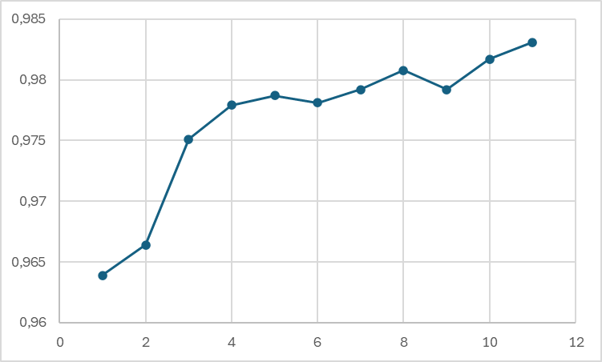
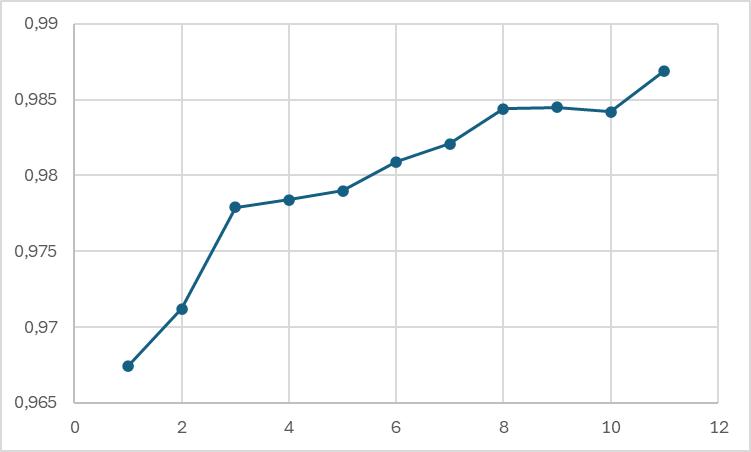
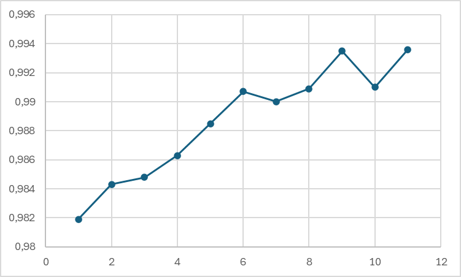

Marc Angéline - Rapport Projet Bio-Inspired Machine Learning 
-----

# Introduction
Le but de ce projet était de mettre en place plusieurs architectures de réseaux de neurones et de les entraîner sur le dataset MNIST pour faire de la reconnaissance/prédiction de nombres. J'ai réalisé ce projet dans le cadre du cours Bio-Inspired Machine Learning du M2 Informatique - IA à l'Université Claude Bernard Lyon 1. Il a été fait en solo et j'ai obtenu une note finale de 17/20. 

# Recherche des hyperparamètres avec puissance infinie
Si nous avions à disposition une puissance de calcul infinie, il serait possible de faire une recherche exhaustive des hyperparamètres avec un Grid Search par exemple. Cela consiste dans le fait de tester toutes les combinaisons possibles d'hyperparamètres dans une grille définie. Il serait également possible de mettre en place un NAS *Neural Architecture Search* qui permet de chercher les meilleurs hyperparamètres pour un modèle donné. Cependant, cette approche est très couteuse en ressources, et n'est donc pas réalisable dans le cadre du projet.

Nous allons maintenant voir plusieurs modèles de réseaux de neurones et essayer de les optimiser. A noter que tous mes résultats de recherche sont disponibles sous forme de fichier texte dans les sous dossiers dédiés à chaque modèle. De plus, pour optimiser un minimum les temps de calcul, j'ai utilisé le GPU de ma machine pour faire fonctionner les différents réseaux.

# Shallow Network
Un shallow network est un réseau de neurones avec une seule couche cachée.
Pour éviter le surapprentissage, il est nécessaire de séparer les données d'entrainement en 2. Pour cela, j'ai choisi de séparer les données en 80% pour l'entrainement et 20% pour la validation, je garderais cette séparation pour tout le reste du TP.
En ce qui concerne le modèle et la fonction de perte, j'ai utilisé respectivement ``MSELoss`` et ``SGD``.

## Hyperparamètres 
Pour avoir les meilleurs résultats, il faut trouver les meilleurs hyperparamètres. Pour cela, j'ai choisi de faire varier les hyperparamètres suivants et dans cet ordre :
- Taux d'apprentissage : 0.005, 0.01, 0.05, 0.1, 0.5
- Nombre de neurones : de 100 en 100 en démarrant de 100 jusqu'à 600, puis en affinant de 50 en 50 autour du palier trouvé et enfin de 10 en 10
- Batch size : 1, 8, ,16, 32, 64, 128
- Nombre d'epoch : de 5 en 5 depuis 5 epoch jusqu'à 40 exclu

Le taux d'apprentissage est l'hyperparamètre à définir en premier, car il aura de l'influence sur tout le reste. Un taux trop élevé entrainera un surapprentissage et provoquera des oscillations dans ledit apprentissage. A l'opposé, un taux trop faible peut ralentir l'apprentissage et nécessiter un nombre d'epoch plus élevé pour avoir de bons résultats.

Ensuite vient le nombre de neurones qui définira la complexité du modèle. J'ai commencé par reprendre le taux d'apprentissage trouvé lors de la recherche précédente ; puis j'ai fait varier mon nombre de neurones en affinant avec des paliers de plus en plus petit.

Le batch size permet de définir par paquet de combien le réseau lira les données.

Enfin vient le nombre d'epoch qui définit le nombre de fois où le modèle verra les données. Il permet d'affiner le modèle. De plus, il s'agit de l'hyperparamètre qui a le plus d'impact sur le temps de calcul. Il faut donc trouver le bon compromis entre précision et temps de calcul.

Mes valeurs de départ pour les hyperparamètres, avant recherche, étaient de 10 epochs, un batch size de 64 et 300 neurones.

## Résultats
Pour le taux d'apprentissage, le meilleur résultat est de 0.5 pour une accuracy de 0.9753.

Mon nombre de neurones optimal est de 410 avec 0.9774 d'accuracy.

J'obtiens une accuracy de 0.9834 en lisant les données 8 par 8.

Enfin, concernant le nombre d'epoch, mon meilleur résultat est techniquement avec 15 epoch mais l'accuracy sur les données de validation fluctue un peu trop. Je reste donc avec 10 epoch et une accuracy finale de 0.9831.

## Conclusion
Nous avons donc un modèle avec un taux d'apprentissage de 0.5, 410 neurones, 8 de taille de batch et 10 epoch qui nous donne une accuracy de 0.9831. C'est un bon résultat pour un modèle simple. Cependant, il est possible d'avoir de meilleurs résultats avec un réseau plus complexe. C'est ce que nous allons voir dans la partie suivante.

# Deep Network
Contrairement au shallow, un Deep Network se définit par le fait d'avoir plusieurs couches cachées. Pour l'architecture, j'ai utilisé la même séparation de données que pour le réseau précédent. De même pour le modèle utilisé ainsi que pour la loss function.
## Hyperparamètres 
Pour ce modèle, il fallait, en plus des autres hyperparamètres définis avec le Shallow, faire varier le nombre de couches cachées. Pour cela j'ai commencé par faire varier le nombre de couches et leurs neurones. Dans le même temps, j'ai regardé le taux d'apprentissage le plus adapté. Enfin, j'ai cherché le batch size optimal et enfin le nombre d'epoch.
- Taux d'apprentissage : 0.1, 0.01, 0.05
- Nombre de couches : 2 et 3
- Nombre de neurones : de 100 à 600 par pas de 200, puis, sur le meilleur résultat, j'ai cherché à affiner en réduisant le pas à 100 autour, et enfin en réduisant à 50
- Batch size : 1, 8, 16, 32, 64, 128
- Nombre d'epoch : 10 et 15

Pour le deep network, mes valeurs initiales étaient de 10 epochs et d'un batch size de 64 .

## Résultats
Pour ma première itération sur la recherche du meilleur eta avec nombre de couches et leurs neurones correspondants, j'ai trouvé que le meilleur était de 0.1 en eta avec 3 couches à 650, 350, 350 avec comme résultat 0.9831. Concernant le nombre de neurones par couches, j'aurais pu essayer de chercher dans des nombres de neurones plus importants et avec un réseau croissant. Cependant, nos données ne sont pas assez complexes pour que cela ait un impact significatif. Pour gagner du temps, je me suis donc contentée de chercher dans une plage de valeur décroissante ou constante et inférieure à 784, ce qui correspond à la valeur de la couche d'input.

Par la suite, j'ai cherché le meilleur batch size. Celui-ci était de 1 avec une accuracy de 0.9869

Enfin, j'ai regardé les epoch. Celle que j'utilisai jusqu'à maintenant s'est révélée être meilleure. Je suis donc resté avec 10 epoch.

## Conclusion
Nous avons donc un modèle avec 3 couches cachées à 650, 350 et 350 neurones, un taux d'apprentissage de 0.1, 30 epochs et un batch size de 1 qui nous donne une accuracy de 0.9869.

De plus, on peut remarquer que le modèle n'est que très légèrement plus performant que le shallow. Je pense qu'il me manque plusieurs optimisations car je trouve cela peu. Il aurait été possible de tester avec d'autres optimiseur ou d'autres loss fonctions. Cependant, j'ai préféré passer au modèle suivant que de rester bloqué sur celui-ci et cherché un meilleur résultat que je n'obtiendrai peut-être pas.

# CNN
Pour la partie CNN j'ai décidé d'utiliser ResNet car je trouvais cela plus intéressant de voir comment faire fonctionner un réseau pré-entrainé que de refaire la définition d'un réseau par moi-même.

Pour cela, j'ai utilisé la librairie `torchvision.models` qui permet d'importer des modèles pré-entrainés. Grâce à elle, j'ai importé ResNet18 qui est un réseau de 18 couches.
## Caractéristique
Pour faire fonctionner ResNet avec les données que nous avions, nous devions au préalable transformer les dites données. Celles qui nous avions correspondaient à un vecteur de taille 784 alors que les réseaux convolutifs sont plus adaptés pour travailler sur des images. Grâce à la fonction `view()` de `torch.Tensor` il a été possible de redimentionner nos images en 28x28. Par la suite, il a fallu leur appliquer une transformation pour les étendre sur trois canaux. Les images obtenues étaient encodées en niveau de gris et donc sur un seul canal de couleur, alors que RestNet attend des images en RGB.
De plus, j'ai du modifier la dernière couche du réseau pour avoir le bon nombre de neurones en sortie.
Concernant le modèle utilisé, j'ai choisi `Adam` et `CrossEntropyLoss` comme fonction de perte.

## Hyperparamètres
Etant donné que ResNet est un réseau pré-entrainé, il y a eu beaucoup moins d'hyperparamètres à faire varier.
- Taux d'apprentissage : 0.00005, 0.0001, 0.0005, 0.001, 0.005, 0.01, 0.05
- Batch size : 8, 16, 32, 64, 128, 256
- Nombre d'epoch : 10

Mes valeurs non optimales étaient de 64 batch size et 10 epoch.

## Résultat
Contrairement aux deux réseaux précédents, le taux d'apprentissage ne correspond pas au plus élevé essayé. Ici, mon meilleur résultat est avec 0.0001 avec 0.9916 d'accuracy. Cela est dû à l'utilisation de Adam comme modèle qui fonctionne mieux avec un taux d'apprentissage bas.

Pour le batch size, il est de 32 pour avoir la meilleure accuracy qui est de 0.9936.

Enfin, je n'ai pas fait varier les epoch car après un test avec un nombre plus haut, je me suis rendu compte que mes valeurs fluctuaient beaucoup. Je suis donc resté avec le nombre de base.

## Conclusion
Nous finissons donc avec un réseau avec 0.0001 de taux d'apprentissage, 32 batch size et 10 epoch pour une accuracy de 0.9936. On peut remarquer sur la courbe que mon réseau a une accuracy un peu fluctuante. Je pense que mon learning rate est trop élevé, mais je n'en ai pas trouvé d'adéquat sans pour autant conserver un bon résultat. Cependant, il s'agit du meilleur résultat que j'ai pu obtenir entre les trois réseaux implémentés. Cela est normal étant donné que les *Convolutional Neural Network* sont plus adaptés pour les images que les réseaux de neurones classiques.

# Conclusion générale
Avec ce projet, nous avons pu mettre en place trois réseaux de neurones de complexité différentes. Cela nous à permis de voir comment les hyperparamètres influent les uns sur les autres ainsi que d'expérimenter la recherche des hyperparamètres optimaux. Ci-dessous un tableau récapitulatif des réseaux implémentés avec leurs résultats finaux :

| Réseaux  | Eta        | Neurones par couches | Batch size | Epoch | Accuracy |
| :--:     |:--:        | :--:                  | :--:       | :--:  | :--:     |
| Shallow  |  0.5       |  410                  | 8          | 10    | 0.9831   |
| Deep     | 0.1        | 650, 350, 350         | 1          | 10    | 0.9869   |
| CNN      |  0.0001    | -                     | 32         | 10    | 0.9936   |

# Améliorations possibles
Il existe plusieurs moyens pour améliorer les résultats des différents modèles. J'aurais pu par exemple chercher à utiliser d'autres optimiseurs et fonctions de perte. J'aurais également pu chercher des hyperparamètres plus précis ou, dans le cas du nombre de neurones, essayer de trouver un nombre croissant de neurones.
Cependant, par manque de temps et des modèles trop longs à entrainer sur ma machine, je n'ai pas eu le temps de mettre cela en place.
